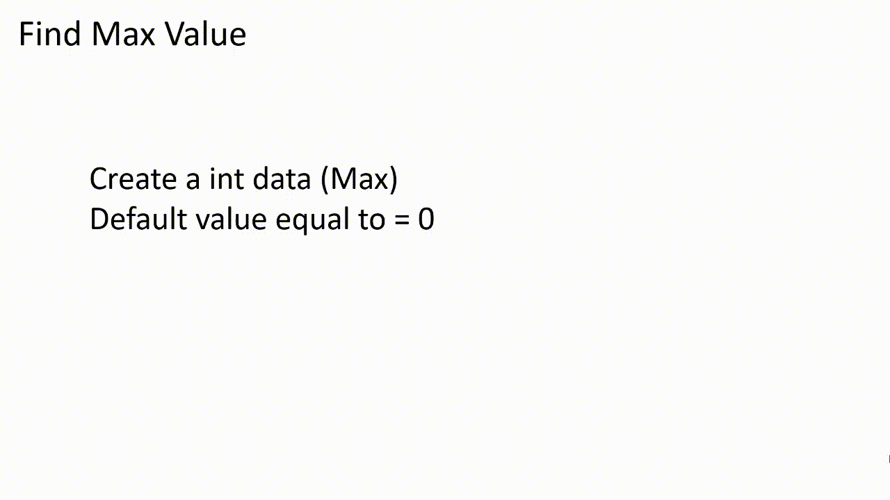

# C++ ile Kuyruktaki Maksimum Değere Ulaşma
- Time Complexity açısından `Array` ve ya `Linked List` implementasyonu aynı olduğundan  bu örnekte `Linked List` kullanılmıştır.
- Amaç `array`lerde yaşanan eleman sınırını ortadan kaldırmaktır.
#
## `Array` ve `Linked List` Time Complexity Değerleri
<table>
    <td> 

### Array
|  OPERATION  |  BEST  | AVERAGE | WORST |  
| ----------- | ------ | ------- | ----- |
| `isEmpty()` |  O(1)  |   O(1)  |  O(1) |
| `enqueue()` |  O(1)  |   O(N)  |  O(N) |
| `dequeue()` |  O(1)  |   O(N)  |  O(N) |
| `peek()`    |  O(1)  |   O(1)  |  O(1) |
    
</td>
<td> 

### LinkedList
|  OPERATION  |  BEST  | AVERAGE | WORST |  
| ----------- | ------ | ------- | ----- |
| `isEmpty()` |  O(1)  |   O(1)  |  O(1) |
| `enqueue()` |  O(1)  |   O(N)  |  O(N) |
| `dequeue()` |  O(1)  |   O(N)  |  O(N) |
| `peek()`    |  O(1)  |   O(1)  |  O(1) |
</td>
</table>

#
## Kaynak:
https://iq.opengenus.org/time-and-space-complexity-of-queue/amp/
#
```cpp
class Node
{
public:
    int data;
    Node* next;
    Node(int data)
    {
        this->data = data;
        this->next = NULL;
    };
};
```
```cpp
class Queue
{
public:
    Node* front;
    Node* rear;
    Queue() { front = rear = NULL; }
```
<table>
    <td> 

```cpp
    void enQueue(int data) {
        Node* temp = new Node(data);

        if (rear == NULL) // Queue boşsa ilk defa ekleme yapılacağı için hem front hem de rear aynı olur. 
        {
            rear = front = temp;    
        }
        else
        {
            rear->next = temp;
            rear = temp;
        }
    }
```
</td>
    <td> </td>  
</table>


<table>
    <td> 

```cpp
    void deQueue()
    {
        if (front == NULL)
        {
            cout << "Queue is empty. [Queue::deQueue]" << endl;
        }
        else
        {
            Node* temp = front;
            front = front->next;

            if (front == NULL) // Queue da tek eleman kaldıktan sonra 'front = front->next;' dediğimiz zaman front NULL olacaktır.
                               // Dolayısıyla Queue boşken nearın da NULL olması gerekir. 
            {
                rear = NULL;
            }

            delete(temp);
        }
    }
```
</td>
    <td> </td>  
</table>

```cpp
    void peek()
    {
        Node* temp = front;
        if ((front == NULL) && (rear == NULL)) {
            cout << "Queue is empty [Queue:peek]" << endl;
            return;
        }
        cout << "Queue elements are: ";
        while (temp != NULL) {
            cout << temp->data << " ";
            temp = temp->next;
        }
        cout << endl;
    }
```

```cpp
    bool isEmpty()
    {
        return (rear == NULL && front == NULL); // Queue boşsa 1 (true) doluysa 0 (false) döndürür.
    }
```

<table>
    <td>

```cpp
    int maxElement()
    {
        if (front == NULL)
        {
            cout << "Queue is empty. [Queue::maxElement]" << endl;
            return NULL;
        }
        else
        {
            Node* temp = front;
            int max = front->data;
            while (temp != NULL) {
                if (temp->data > max)
                    max = temp->data;
                temp = temp->next;
            }
            return max;
        }
    }
```
</td>
    <td> </td>  
</table>


```cpp
    int size()
    {
        int counter = 0;
        if (front == NULL)
        {
            cout << "Queue is empty. [Queue::size]" << endl;
        }
        else
        {
            Node* temp = front;
            while (temp != NULL)
            {
                counter += 1;
                temp = temp->next;
            }
        }
        return counter;
    }
};
```
```cpp
int main()
{
    Queue q; 
    int temp;

    while (true)
    {
        cout << "---------------------------------" << endl;
        cout << "1- Kuyruga eleman ekle." << endl;
        cout << "2- Kuyruktan eleman sil." << endl;
        cout << "3- Kuyrugu listele." << endl;
        cout << "4- Kuyruktaki maksimum degeri bul." << endl;
        cout << "5- Cikis." << endl;
        cout << "---------------------------------" << endl;

        cin >> temp;

        switch (temp)
        {
        case 1:
            int value;
            cout << "Eklenecek elemani girin." << endl;
            cin >> value;
            q.enQueue(value);
            break;
        case 2:
            q.deQueue();
            break;
        case 3:
            q.peek();
            break;
        case 4:
            cout << "The max value is: " << q.maxElement() << endl;
            break;
        case 5:
        default:
            exit(0);
            break;
        }
    }
    return 1;
}
```