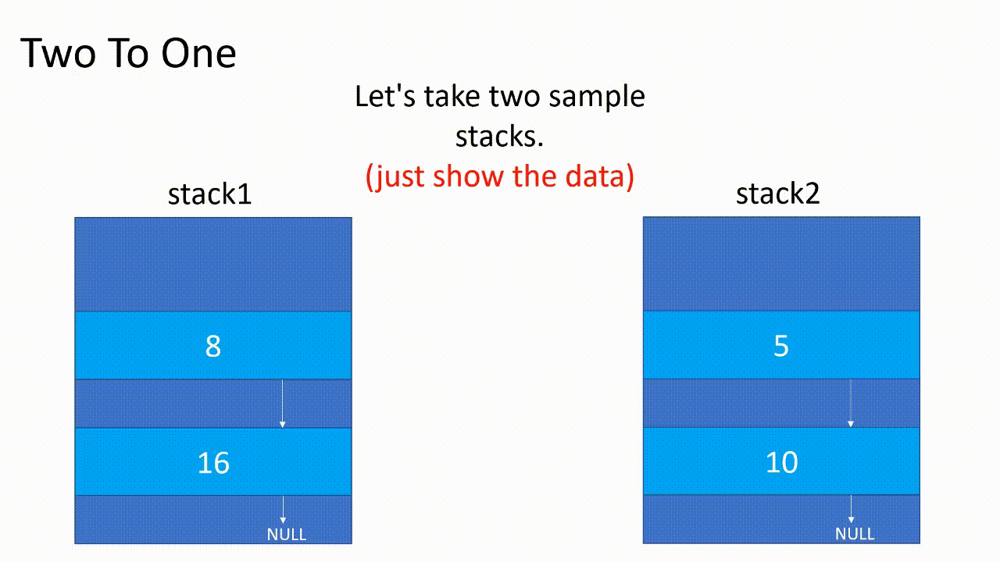

<table>
    <td> 

```cpp
    Stack twoToOne(Stack stack1, Stack stack2)
    {
        Stack newStack;
        Node* temp1 = stack1.top;
        Node* temp2 = stack2.top;
        while (temp1 != NULL || temp2 != NULL )
        {
            if (temp1 == NULL) {
                newStack.push(temp2->data);
                temp2 = temp2->link;
            }
            else if (temp2 == NULL)
            {
                newStack.push(temp1->data);
                temp1 = temp1->link;
            }
            else
            {
                if (temp1->data < temp2->data) {
                    newStack.push(temp1->data);
                    temp1 = temp1->link;
                }
                else if (temp2->data < temp1->data) {
                    newStack.push(temp2->data);
                    temp2 = temp2->link;
                }
                else
                {
                    newStack.push(temp1->data);
                    temp1 = temp1->link;
                    newStack.push(temp2->data);
                    temp2 = temp2->link;
                }
            }
        }
        return newStack;
    }
```
</td>
    <td> </td>  
</table>